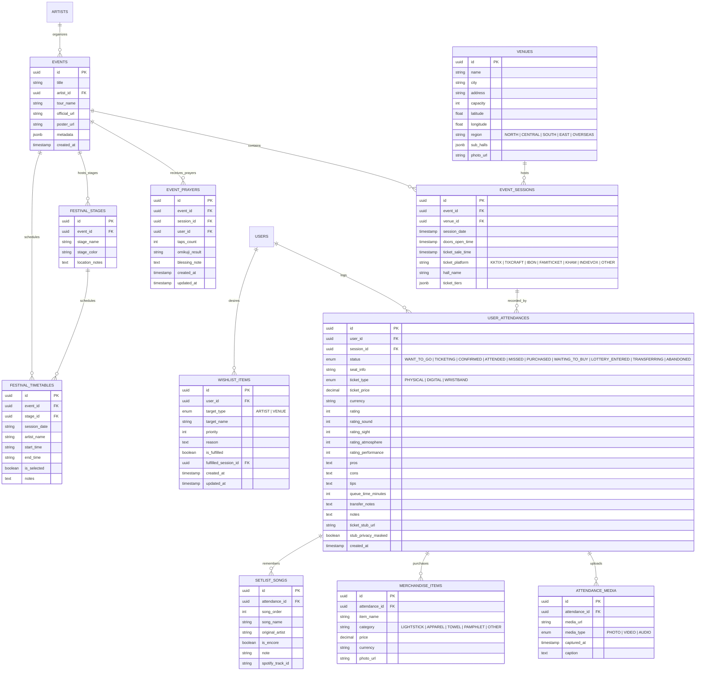

# 🏛️ StubBook 系統架構與技術設計規格書 (Architecture & System Design)

本文檔記錄 **StubBook**（演唱會歷程與資訊記錄系統）的整體架構、資料模型、網頁解析管線（Parsing Pipeline）、跨平台支援策略以及安全性設計。

---

## 1. 系統整體架構 (System Architecture)

StubBook 採 **Next.js PWA + Capacitor 單一程式碼庫 (方案 A)** 搭配 **Turborepo** 模組化設計。前後端、爬蟲核心與資料庫存取分層解耦：

```
                    ┌──────────────────────────────────────────────┐
                    │               客戶端 (Clients)               │
                    ├──────────────────────────────────────────────┤
                    │     統一前端程式庫 (Next.js 14+ App Router)   │
                    ├──────────────────────┬───────────────────────┤
                    │  PC / Desktop Web    │  Mobile App / PWA     │
                    │  - 大螢幕票夾與統計  │  (Capacitor + PWA)    │
                    │  - 詳細遊記/歌單排版 │  - 現場拍照/離線票夾  │
                    │                      │  - 系統級分享延伸模組 │
                    └──────────┬───────────┴──────────┬────────────┘
                               │                      │
                               ▼                      ▼
┌──────────────────────────────────────────────────────────────────────────┐
│                   BFF & API 服務層 (Next.js Server Actions / API)        │
├────────────────────────────────┬─────────────────────────────────────────┤
│  本地單機儲存 (Local Storage)   │  票根隱私遮罩與畫布渲染 (Canvas / Satori)│
│  預算與統計彙總服務 (Analytics) │  外部串接 (Spotify PKCE / Apple / YT / FM)│
└────────────────────────────────┴─────────────────────────────────────────┘
                               │
               ┌───────────────┴───────────────┐
               ▼                               ▼
┌───────────────────────────────┐  ┌───────────────────────────────────────┐
│ 網頁擷取與解析管線 (Scraper)  │  │ 本地資料庫與檔案儲存 (SQLite)         │
├───────────────────────────────┤  ├───────────────────────────────────────┤
│ Tier 1: Meta / JSON-LD 標籤   │  │ Database: SQLite (better-sqlite3, WAL)│
│ Tier 2: 專屬平台 Scraper 適配器│  │ Mode: 本地單機，零雲端依賴           │
│         - KKTIX / 拓元 tixCraft │  │ Storage: 本地檔案系統 (票根/照片)     │
│         - ibon / FamiTicket    │  │                                       │
│         - 寬宏售票 / INDIEVOX   │  │                                       │
│ Tier 3: Playwright / Cheerio  │  │                                       │
└───────────────────────────────┘  └───────────────────────────────────────┘
```

---

## 2. 網頁資訊自動抓取方案 (Parsing Pipeline)

售票平台（KKTIX、拓元 tixCraft、ibon、FamiTicket、寬宏售票、INDIEVOX）結構異質且具備防爬蟲機制。StubBook 採用**高確定性的三層解析管線 (3-Tier Parsing Pipeline)**：

```
[輸入售票網址]
      │
      ▼
[Tier 1: 靜態 Meta & 結構化資料] ─── (包含完整 MusicEvent 資料?) ───► [輸出結構化 JSON]
      │ 否 / 欄位不齊全
      ▼
[Tier 2: 售票平台專屬適配器 Scraper (支援全台 6 大平台)]
      ├──► KKTIX Scraper (API / DOM 抽取場次、主辦、票價) ──────► [輸出結構化 JSON]
      ├──► tixCraft 拓元 Scraper (DOM 表格解析多場次、分區票價) ──► [輸出結構化 JSON]
      ├──► ibon 售票系統 Scraper (多場次、全區票價與開賣時間) ────► [輸出結構化 JSON]
      ├──► FamiTicket 全網購票網 Scraper (多場次、分區票價解析) ─► [輸出結構化 JSON]
      ├──► 寬宏售票 Kham Scraper (藝文/大型展演場次與票價抽取) ──► [輸出結構化 JSON]
      └──► INDIEVOX 獨立音樂網 Scraper (Livehouse專場/進場/售票) ──► [輸出結構化 JSON]
      │ 遇特殊動態渲染或反爬蟲
      ▼
[Tier 3: Playwright Stealth 動態渲染引擎] ───────────────────────► [輸出結構化 JSON]
```

### 解析管線分層職責：

1. **Tier 1 (輕量標籤優先 - Meta & JSON-LD):**
   - 使用輕量 HTTP 客戶端取得 HTML，優先讀取 `schema.org/MusicEvent`（JSON-LD）或 Open Graph 標籤（`og:title`, `og:image`, `og:description`）。
   - 耗時極短（<300ms），適用於結構友善的活動專頁。
2. **Tier 2 (全台 6 大售票平台專屬適配器):**
   - **KKTIX Scraper**：針對 KKTIX 活動頁面結構，解析演出者、多場次時間、售票狀態與組織者。
   - **tixCraft (拓元) Scraper**：精確抽取拓元活動場次表（多日期時間）、實名制規則、分區票價及開賣倒數。
   - **7-ELEVEN ibon 售票系統 Scraper**：解析 ibon 活動詳情頁面，抽取多場次日期時間、全票種/票價級距與開賣時間。
   - **全家 FamiTicket 全網購票網 Scraper**：解析 FamiTicket 活動結構，支援多場次演出時間、各區票價及預售截止時間。
   - **寬宏售票 (Kham Ticketing) Scraper**：針對寬宏大型展演與藝文舞台劇，解析多場次排程、斜線/逗號分隔分區票價與啟售時程。
   - **INDIEVOX 獨立音樂網 Scraper**：針對獨立音樂 Livehouse 專場，解析演出與入場時間、多階段開賣時間與預售/現場票價。
3. **Tier 3 (動態渲染備援 - Playwright Stealth):**
   - 針對重度客戶端渲染（SPA）或有動態 DOM 的頁面，啟動無頭瀏覽器載入並執行 JavaScript 後再行解析。

---

## 3. 資料庫結構設計 (Database Schema)

基於 **SQLite (better-sqlite3)**，將模型拆分為**活動本體（Tour/Event）**、**具體場次（EventSession）**與**個人參與回憶（UserAttendance）**，避免重複建檔：



---

## 4. 關鍵設計細節 (Architecture Highlights)

### ① 巡迴與多場次分離 (Tour & Multi-Session Architecture)

- 演唱會多為連開多日（如：五月天跨年、Coldplay 連開數場）。拆分 `Event` 與 `EventSession`，爬蟲抓到多場次時一次建立關聯場次，使用者可精確標記「參加了哪一天的哪一場」。

### ② 票根個資與條碼智慧隱私遮罩 (Ticket Stub Privacy Shield)

- 實體與電子票根包含條碼 (Barcode / QR Code)、身分證字號與訂單序號。
- 前端票券預覽與上傳模組內建 **Canvas 自動偵測條碼區域** 並提供「一鍵高斯模糊/遮罩」，保護個人隱私。

### ③ 演唱會預算與全旅程記帳 (Expense & Travel Tracking)

- 擴充個人記錄模組，提供「總支出追蹤」（門票、手續費、交通、住宿與官方周邊），支援多國幣別轉換。

### ④ 現場無網路環境與離線票夾 (Offline-First Resilience)

- 數萬人場館現場往往基地台癱瘓無法連網。
- PWA 與 Mobile 端支援 **Service Worker 靜態快取 + IndexedDB 離線快取**。票券座位、演出須知即便處於飛航模式亦可即時離線開啟。

### ⑤ 串流音樂全生態深度聯動與自動同步 (Full Streaming Music Hub)

- **Setlist.fm 智慧曲目匯入**：演出結束後自動比對 Setlist.fm API，匯入現場真實演奏曲目與安可曲，並具備離線智慧降級備援。
- **Spotify OAuth 2.0 PKCE 深入整合**：純前端安全 PKCE 授權，自動調用 Spotify Web API 在用戶帳號內建立現場專屬播放清單。
- **智慧曲目名稱去雜訊演算法 (`cleanSongTitle`)**：自動濾除 `(Intro)`, `[Live]`, `(Acoustic)`, `(Encore)`, `feat.` 等現場標籤，提升跨平台檢索準確率。
- **Apple Music (MusicKit JS) 整合**：支援 MusicKit 憑證授權與 Catalog 曲目搜尋，自動加入用戶音樂庫或生成搜尋深度連結。
- **YouTube Music 整合**：結合 YouTube Data API v3 檢索官方音訊/MV 並自動建立播放清單。
- **本地憑證隔離安全架構**：所有 Client ID 與 Access Token 僅存放於使用者瀏覽器 LocalStorage，零雲端金鑰洩漏風險。

### ⑥ 年度回顧與視覺化票根手帳 (Concert Wrapped & Canvas)

- **擬真票根牆**：提供復古撕票線、雷射防偽質感的數位票根手帳模式。
- **年度足跡 Wrapped**：年終自動產出專屬分享小卡（IG Story / Threads 規格）：年度場次、歌手雷達圖、踩點場館與花費統計。

### ⑦ 視覺相片月曆與 9:16 手機桌布生成 (Visual Photo Calendar & Wallpaper Engine)

- **雙模式切換**：行事曆具備「視覺相片模式」與「經典標籤模式」無縫切換，單元格以演出海報封面或自訂現場精選照填滿，整月回憶一覽無遺。
- **HTML5 Canvas 鎖定畫面桌布導出**：支援以 1080×1920 (9:16) 原生手機解析度合成個人當月參戰桌布，內建高對比深色漸層底圖、海報矩陣與參戰統計數字。

### ⑧ 抽票祈願儀式感與 Web Audio 擬真木魚 (Gacha Prayer & Audio Synthesis)

- **推活集氣儀式**：提供點擊敲木魚累積功德與全場祈願次數，整合 Web Audio API 純代碼振盪器（440Hz -> 110Hz 指數衰減）與 Capacitor 觸覺震動，零外掛音檔負擔。
- **專屬神籤與開賣御守圖卡**：自動求取「超大吉」、「神席吉」、「特上吉」等趣味開賣神籤，並透過 Canvas 渲染 600×900 像素之開運御守卡供社群分享。

### ⑨ 票券全生命週期狀態機與安全讓換票指南 (Ticket Lifecycle & Anti-Fraud Safety)

- **10 種全生命週期狀態**：支援 `PURCHASED`、`WAITING_TO_BUY`、`LOTTERY_ENTERED`、`TICKETING`、`CONFIRMED`、`TRANSFERRING`、`ABANDONED`、`ATTENDED`、`MISSED`、`WANT_TO_GO` 完整追蹤。
- **讓換票防詐安全指南**：內建「防詐五不原則」、實名制現場檢核清單與安全面交交易備忘錄範本，支援一鍵複製安全文案。

### ⑩ 五維演出評鑑模型與結構化參戰筆記範本 (5D Review System & Structured Journal)

- **多維度演出評鑑**：涵蓋綜合評分 (Overall)、音響音質 (Sound)、視野角度 (Sight)、現場氛圍 (Atmosphere)、藝人表現 (Performance) 五維星等。
- **結構化手帳範本模組**：支援填寫排隊耗時 (分鐘)、亮點好評、踩雷提醒、避坑貼士與換票備忘，沉澱高價值推活攻略資料庫。

---

## 5. 跨平台多端實現策略 (方案 A: Next.js PWA + Capacitor)

採用 **方案 A：單一程式碼庫全平台架構**：

| 平台                  | 容器 / 技術                             | 核心體驗場景                                                         |
| --------------------- | --------------------------------------- | -------------------------------------------------------------------- |
| **Desktop Web**       | Next.js 14+ (App Router) + Tailwind CSS | 大螢幕票夾、統計儀表板、批次管理、高解析相片牆                       |
| **Mobile Web (PWA)**  | Next.js + next-pwa + Web Share Target   | 輕量免安裝、桌面捷徑、接收手機瀏覽器分享的售票網址                   |
| **iOS / Android App** | Capacitor 封裝 Next.js 前端             | 原生相機拍攝票根、離線 SQLite/IndexedDB 快取、系統級 Share Extension |

### 5.1 Android 原生工程架構 (Android Native Shell)

- **Gradle 雙發行管線**：支援現代 Android 10+（API Level 29~34+），提供 Release APK 與 AAB (Android App Bundle) 生產構建指令 (`pnpm build:android`)。
- **R8 / ProGuard 防混淆與壓縮**：在 `proguard-rules.pro` 中完整保護 Capacitor 核心通道、WebKit `@JavascriptInterface`、Cordova 外掛與原生反射類別，發行建置自動開啟 `minifyEnabled true` 與 `shrinkResources true`。
- **權限與 Web Share Target**：於 `AndroidManifest.xml` 配置相機、相簿讀寫、震動馬達、網路狀態與行事曆權限，並宣告 `android.intent.action.SEND` (`text/plain`) Intent Filter，支援從手機各大瀏覽器一鍵分享售票連結至 StubBook。
- **Edge-to-Edge 沉浸介面**：透過 `styles.xml` 與 `colors.xml` 配置透明狀態列與導航列，完美貼合 AMOLED 黑色背景。

### 5.2 iOS 原生工程架構 (iOS Native Shell)

- **Xcode 專案與 CocoaPods**：以 iOS 14.0+ 為最低部署目標，統一管理 Capacitor 核心與相機、檔案系統、狀態列、網路、觸覺回饋外掛。
- **App Store 隱私合規與 URL Scheme**：於 `Info.plist` 提供完整權限宣告（`NSCameraUsageDescription`、`NSPhotoLibraryUsageDescription`、`NSCalendarsUsageDescription`）與 `stubbook://` 深層鏈接協定。
- **動態島 (Dynamic Island) 與 Safe Area 適配**：透過全域 CSS 變數 `--sat: env(safe-area-inset-top)` 等與 `.pt-safe`、`.pb-safe` 邊界工具類，無縫適配 iPhone 靈動島、頂部瀏海與底部 Home Indicator 手勢條。

### 5.3 原生硬體外掛橋接矩陣 (Native Hardware Plugins Suite)

系統於 `apps/web/src/utils/native/` 建構了抽象橋接層，具備原生環境與 Web / Node.js 雙向相容與無聲降級機制：

- `nativeBridge`：即時檢測 Capacitor 原生執行時環境與平台。
- `nativeCamera`：封裝 `@capacitor/camera`，拍照即自動觸發 Canvas 條碼個資高斯模糊遮罩；Web 環境自動降級為檔案選擇器。
- `nativeFilesystem`：封裝 `@capacitor/filesystem`，直接將 `.stubbook` 容器導出至手機 Documents 資料夾。
- `nativeHaptics`：調用原生線性馬達提供 Light, Medium, Heavy, Success, Warning, Selection 觸覺層次。
- `nativeNetwork`：監控蜂巢行動網路與 Wi-Fi 連線，支援現場壅塞弱網雷達。
- `nativeStatusBar`：控制狀態列深色主題與全螢幕現場沉浸模式。
- `nativeCalendar`：原生日曆排程與提醒整合。

### 5.4 行動端專屬「現場沉浸模式 (Live Concert Mode)」

- **巨型座位指示牌 (Seat View)**：高對比發光字體，昏暗場館出示秒看座位分區與排號。
- **驗票速刷視圖 (Turnstile Scanner)**：一鍵切換螢幕最大亮度 (純白防反光)，讓驗票閘門掃描器秒讀條碼。
- **現場人潮弱網雷達 (Offline Protector)**：數萬人擠爆基地台時自動切換離線快取防護，票券、回憶與手帳 100% 離線可用。
- **舞台視野速拍、現場速記與虛擬應援手燈**：即時快拍舞台視角、速記 Talking 感動，並提供五色螢光棒揮舞燈效。

---

## 6. 安全性與權限控制 (Security & Governance)

1. **SQL 注入防護與安全查詢**:
   - 資料庫操作全面採用**參數化查詢（Prepared Statements）**，嚴禁字串拼接 SQL；資料庫開啟外鍵約束與 WAL 模式保障交易完整性。
2. **防爬蟲與合規 (Scraping Compliance)**:
   - 爬蟲管線僅擷取公開演出時間與售票資訊，嚴禁儲存個人訂票個資；設定合理 Rate Limiting 與 User-Agent 宣告。
3. **媒體本地安全儲存與敏感資訊遮罩**:
   - 票根與照片直接儲存於本機安全目錄，前端上傳時強制執行條碼 (Barcode) 與個人資料自動高斯模糊遮罩，防止隱私洩漏。

---

## 7. 本地資料安全、備份還原與 `.stubbook` 容器規格 (Data Portability & Backup Engine)

### 7.1 資料主權與全量備份架構理念 (Data Sovereignty)

StubBook 堅持 **100% 本地資料主權（Zero-Cloud Dependency）**，使用者記錄的票根、回憶日記、消費記帳與實名制入場時程完全存放於本地端 SQLite 與檔案系統。為提供跨裝置遷移與災難復原能力，系統建構了 **純本地備份與還原引擎（Backup & Restore Subsystem）**：

```
┌────────────────────────────────────────────────────────────────────────┐
│                        .stubbook 容器 (ZIP Archive)                    │
│                                                                        │
│  ├── manifest.json        (規格版本、產出時間戳、資料筆數統計、SHA-256 數位簽章)   │
│  ├── database.sqlite      (透過 SQLite 'VACUUM INTO' 產出的一致性無鎖快照)   │
│  └── uploads/             (遞迴封裝所有本機上傳票根、相片、影片與視野視角)     │
│       ├── stubs/                                                       │
│       ├── photos/                                                      │
│       ├── seatviews/                                                   │
│       └── videos/                                                      │
└────────────────────────────────────────────────────────────────────────┘
```

### 7.2 `.stubbook` 容器與檔案規格 (Container Specification)

1. **容器格式 (Format)**：標準 ZIP 二進位壓縮檔，副檔名為 `.stubbook`。
2. **`manifest.json` 綱要 (Manifest Schema)**：
   ```json
   {
     "formatVersion": "1.0.0",
     "appName": "StubBook",
     "appVersion": "2.2.0",
     "createdAt": "2026-09-12T00:00:00.000Z",
     "database": {
       "filename": "database.sqlite",
       "sha256": "e3b0c44298fc1c149afbf4c8996fb92427ae41e4649b934ca495991b7852b855",
       "size": 131072,
       "counts": {
         "events": 12,
         "sessions": 18,
         "attendances": 8,
         "merchandise": 5,
         "media": 24,
         "seatViews": 6,
         "setlists": 3,
         "salePhases": 14
       }
     },
     "mediaFiles": [
       {
         "path": "uploads/stubs/ticket-123.webp",
         "sha256": "a591a6d40bf420404a011733cfb7b190d62c65bf0bcda32b57b277d9ad9f146e",
         "size": 45120
       }
     ]
   }
   ```
3. **資料庫無鎖快照 (`VACUUM INTO`)**：
   - 不採用單純複製使用中的 `.sqlite` 檔案（避免 WAL 模式下鎖定與髒讀）。
   - 調用 SQLite 3.27+ 原生指令 `VACUUM INTO ?`，產出完全重組（De-fragmented）、無 WAL 依賴、完整提交的一致性單一檔案快照。
4. **多媒體資產遞迴封裝**：
   - 走訪 `public/uploads` 目錄，將票根圖、現場相片、場館視野圖等靜態資源按原始路徑層級寫入 ZIP，並為每一份媒體檔計算 SHA-256 雜湊登記於清單。

### 7.3 安全性與強健防護 (Security Hardening)

1. **SHA-256 數位簽章與防竄改驗證 (Integrity Check)**：
   - 還原時優先解出 `manifest.json`，並對 `database.sqlite` 與解壓縮之媒體資產計算即時雜湊值。
   - 若 SHA-256 簽章不吻合，系統拒絕還原並回傳警告，防止檔案毀損或中途遭篡改。
2. **Zip Slip (路徑穿越攻擊 Path Traversal) 嚴格防禦**：
   - 封裝解壓模組實作 `assertSafePath(baseDir, relativePath)`。
   - 嚴格解析絕對規範化路徑（`path.resolve`），確保解壓目標嚴格位於安全隔離基底目錄內（`resolved.startsWith(safePrefix + path.sep)`），杜絕利用 `../` 覆蓋系統敏感檔案之攻擊風險。
3. **交易一致性與災難回滾備份 (`.bak` Fallback)**：
   - 在執行全量覆蓋還原前，系統自動於本地建立 `.bak` 備份檔（如 `database.sqlite.bak`）。
   - 若在還原寫入或外鍵檢查階段發生任何例外，立即自動回滾至原先資料庫與媒體庫，保障資料零毀損。

### 7.4 多模式智慧還原 (Restore Strategies)

還原引擎支援三種作業策略：

- **`OVERWRITE` (全量覆蓋替換)**：
  關閉既有資料庫連線，以快照檔案完整替換目前資料庫與媒體檔案，適合跨裝置無痛整機轉移。
- **`MERGE` (增量合併)**：
  透過 SQLite `ATTACH DATABASE` 技術，在單一交易內比對主鍵與外鍵關聯，以 `INSERT OR IGNORE` 匯入不重複的藝人、場館、演出、個人參戰回憶與歌單。既有資料保留不被覆蓋。
- **`DIFF` (乾跑預覽與差異檢視)**：
  支援 `dryRun: true` 模式，解構備份檔並與目前資料庫比對，回傳新活動數、新回憶數與重複項目數，讓使用者在確認還原前一目了然。

### 7.5 API 端點規範 (API Specification)

| 端點           | 方法   | 參數                  | 說明                                                                        |
| :------------- | :----- | :-------------------- | :-------------------------------------------------------------------------- |
| `/api/backup`  | `GET`  | `overview=true`       | 取得目前本地資料筆數、資料庫大小與媒體用量總覽 (JSON)                       |
| `/api/backup`  | `GET`  | `format=stubbook`     | 一鍵匯出並下載 `.stubbook` 全量封裝二進位壓縮檔 (ZIP)                       |
| `/api/backup`  | `GET`  | `format=json`         | 匯出跨平台標準純文字 JSON 資料庫內容 (Portable JSON)                        |
| `/api/restore` | `POST` | `multipart/form-data` | 上傳 `.stubbook` 二進位封裝檔，支援 `dryRun` 預覽與 `mode=OVERWRITE\|MERGE` |
| `/api/restore` | `POST` | `application/json`    | 上傳 JSON 備份物件進行快速文字型資料匯入與合併                              |

---

## 8. 推活儀式感、相片月曆與多維手帳範本 (Visual Photo Calendar & Fan Rituals)

### 8.1 視覺相片月曆與 9:16 桌布合成引擎 (Visual Photo Calendar & Wallpaper Engine)

1. **雙模式切換**：`CalendarDashboard.tsx` 支援「視覺相片模式 (Photo Mode)」與「經典標籤模式 (Classic Mode)」自由切換。相片模式下，日曆日期單元格自動載入演出海報或活動封面，讓整月份直接化為精美推活回憶相片牆。
2. **高畫質手機鎖定畫面桌布導出**：
   - 純前端 HTML5 `<canvas>` 繪製，無須依賴伺服器轉檔，輸出標準 1080×1920 (9:16) 原生高解析度 PNG。
   - 包含極致深黑漸層背景、當月參戰統計徽章（總場次、累積花費、參戰藝人）、當月星期格線與海報縮圖矩陣。
   - 點擊「一鍵導出手機桌布」即可即時預覽並一鍵下載，方便更換為手機鎖定畫面。

### 8.2 抽票祈願儀式感與 Web Audio 擬真木魚 (Ticket Prayer Ritual & Audio Synthesis)

1. **純代碼 Web Audio 音效合成**：
   - 利用 `AudioContext` 建立自定義雙振盪器（三角波 + 正弦波），透過 `exponentialRampToValueAtTime` 模擬 440Hz 至 110Hz 之純淨木魚敲擊聲與共振，零外部音訊檔案相依，無延遲且體積為零。
   - 結合 `@capacitor/haptics` 進行敲擊微震動回饋，並在前端動態呈現「功德 +1」粒子動畫。
2. **全場集氣與專屬開運籤詩**：
   - `/api/prayers` 支援累計個人功德次數與全場累積祈願次數。
   - 提供「超大吉」、「神席吉」、「特上吉」、「良席吉」、「安全開演吉」等 8 種隨機開賣神籤，並透過 Canvas 渲染 600×900 像素之開運御守圖卡供社群轉發分享。

### 8.3 票券全生命週期狀態機與安全換票指南 (Ticket Lifecycle & Anti-Fraud Safety)

1. **10 種全生命週期狀態**：
   - 全面追蹤票務生命週期：`PURCHASED`（已購票）、`WAITING_TO_BUY`（待搶票）、`LOTTERY_ENTERED`（抽票登記中）、`TICKETING`（搶票中）、`CONFIRMED`（確定參戰）、`TRANSFERRING`（讓票/換票中）、`ABANDONED`（未中籤/已放棄）、`ATTENDED`（已參戰）、`MISSED`（未前往）、`WANT_TO_GO`（想去/觀望中）。
2. **讓換票防詐安全手冊 (`SafeTransferGuideModal.tsx`)**：
   - 整理現場樂迷必備「防詐五不原則」（堅持面交、拒絕點擊假第三方驗證連結、警惕非官方轉帳等）。
   - 提供實名制驗證核對清單與交易備忘錄範本，支援一鍵複製標準安全確認訊息。

### 8.4 五維度演出評鑑模型與結構化手帳範本 (5D Review System & Structured Journal)

1. **五維度星等模型**：
   - 資料庫 `user_attendances` 擴充 `rating_sound`（音響音質）、`rating_sight`（視野角度）、`rating_atmosphere`（現場氛圍）、`rating_performance`（藝人表現）與 `rating`（綜合評分）。
   - 前端提供互動式點選評分，於票根手帳卡以多維星等卡片優雅呈現。
2. **結構化參戰筆記模組**：
   - 欄位化記錄「排隊耗時 (queue_time_minutes)」、「亮點好評 (pros)」、「踩雷提醒 (cons)」、「避坑貼士 (tips)」與「換票備忘 (transfer_notes)」。
   - 提供完整攻略型筆記，沉澱為個人參戰推活知識庫。

---

## 9. 巡迴足跡地圖、秒級即時動態與多舞台場館庫 (Tour Footprint Map & Live Activities)

### 9.1 巡迴足跡向量互動地圖架構 (Tour Footprint Map & Vector Projection)

1. **墨卡托座標投影演算法 (Mercator Projection Engine)**：
   - 將場館地理經緯度 (`latitude`, `longitude`) 映射至 SVG 視窗座標 (viewBox `0 0 500 700`)。
   - 台灣本島座標轉換模型：
     ```typescript
     x = ((longitude - 119.8) / (122.2 - 119.8)) * 420 + 40;
     y = ((25.5 - latitude) / (25.5 - 21.8)) * 600 + 40;
     ```
   - 具備跨國海外指標場館（如日本東京巨蛋、日本武道館、英國倫敦 Wembley 體育館等）專屬獨立分頁。
2. **打卡光暈階梯渲染**：
   - 依據使用者在該場館歷史參戰次數 (`sessionCount`)，動態調節點位顏色與擴散光暈（0~~1 次：emerald 綠，2~~3 次：amber 黃，4 次以上：rose 玫瑰紅，標記半徑從 `r=6` 至 `r=11` 漸層增強）。
3. **場館深潛探索面板 (`TourFootprintMap.tsx` & `/api/footprint`)**：
   - 點擊任一場館標記即可展開深潛視窗：
     - 該場館歷史參戰時序歷程與座位資訊。
     - 該場館現場視角照片縮圖輪播。
     - 累積門票出費統計總額。
     - Google Maps 原生經緯度一鍵導航連結。
4. **已知熱門場館字典自動補全**：
   - 內建台北小巨蛋、北流、高流、Legacy、Zepp New Taipei、高雄國家體育場等熱門場館之經緯度、縣市行政分區與多廳結構字典，活動建立時自動填充。

### 9.2 秒級精密動態倒數卡與 Live Activities 狀態機 (Live Activities & Precision Countdown)

1. **動態精密跳動時鐘**：
   - 前端採用 1000ms 高頻率定時器精確計算「天、時、分、秒」，避免依賴靜態重整。
   - 提供數字平滑滾動與高對比發光字型。
2. **5 階段生命週期狀態機 (5-Phase Live Activity Lifecycle)**：
   - 依據演出當日開場時間與開場前/後時程，自動流轉 5 個狀態：
     - `QUEUEING` (場外整隊/周邊領取)：開演前 4 小時至 2 小時，引導查看周邊購買清單與排隊攻略。
     - `DOORS_OPEN` (開放入場/驗票)：開演前 2 小時至 30 分鐘，提示預備票券與快速通關。
     - `COUNTDOWN` (開演倒數)：開演前 30 分鐘內，秒級狂熱倒數。
     - `LIVE` (熱血開演中)：演出進行中（開演至開演後 3 小時），一鍵直達「現場沉浸模式」，點亮發光座位牌與手燈。
     - `EXIT` (散場交通/回味)：演出結束散場，提示交通動線並引導速記手帳與歌單。
3. **行動端推播與靈動島模擬**：
   - `/api/live-activity` 支援狀態查詢與模擬推播推播通知。

### 9.3 大型場館多廳子分區與音樂祭 Timetable 排程 (Multi-Hall & Festival Timetable)

1. **場館多廳結構 (Sub-Halls Hierarchy)**：
   - `venues` 資料表擴充 `sub_halls TEXT (JSON array)` 與 `event_sessions.hall_name TEXT`。
   - 支援如「台北南港展覽館 (1館 4F / 2館 1F)」、「高雄流行音樂中心 (海音館 / 鯨魚堤岸 / LIVE WAREHOUSE)」等階層式廳別管理。
2. **音樂祭多舞台資料結構 (`festival_stages` & `festival_timetables`)**：
   - 一對多關聯活動，記錄各舞台名稱 (`stage_name`)、專屬配色 (`stage_color`) 與演出時間區間 (`start_time`, `end_time`)。
3. **衝堂重疊偵測演算法 (Schedule Clash Detection Algorithm)**：
   - 針對使用者已選取（`is_selected = 1`）的必看演出時間槽，雙迴圈比對時間重疊：
     ```typescript
     clashDuration = Math.min(endA, endB) - Math.max(startA, startB);
     if (clashDuration > 0) -> 產生衝堂警示
     ```
   - 於介面頂端顯示警告橫幅，標明衝堂演出者與重疊分鐘數，並即時統計個人跑台動線清單。

### 9.4 朝聖心願池與售票雷達智慧匹配 (Wishlist & Ticketing Radar)

1. **朝聖心願池清單 (`wishlist_items`)**：
   - 記錄夢想藝人 (`ARTIST`) 或夢想場館 (`VENUE`)，設定 1~5 星優先度與許願原因。
2. **售票爬蟲資料庫智慧雷達匹配**：
   - `/api/wishlist` 執行時，遍歷未圓夢心願，自動在 `events` 與 `venues` 中模糊比對活動名稱、藝人名稱或場館。
   - 若發現有售票中或即將開賣的匹配活動，自動掛載 `matchedEvents` 清單，並在介面展示醒目的「🎯 售票雷達已捕獲！」提示卡。
3. **圓夢解鎖成就**：
   - 使用者參戰後一鍵勾選「已圓夢」，自動關聯至參戰場次 `fulfilled_session_id`，並觸發五彩紙屑慶祝動效。
