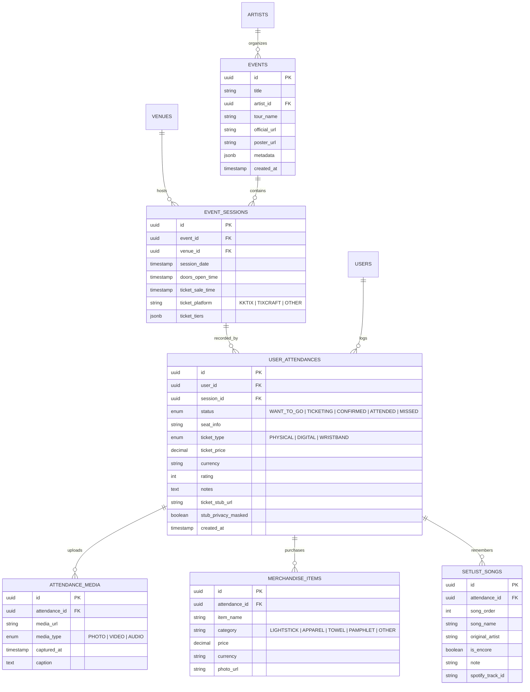

# 🏛️ StubBook 系統架構與技術設計規格書 (Architecture & System Design)

本文檔記錄 **StubBook**（演唱會歷程與資訊記錄系統）的整體架構、資料模型、網頁解析管線（Parsing Pipeline）、跨平台支援策略以及安全性設計。

---

## 1. 系統整體架構 (System Architecture)

StubBook 採 **Next.js PWA + Capacitor 單一程式碼庫 (方案 A)** 搭配 **Turborepo** 模組化設計。前後端、爬蟲核心與資料庫存取分層解耦：

```
                    ┌──────────────────────────────────────────────┐
                    │               客戶端 (Clients)               │
                    ├──────────────────────────────────────────────┤
                    │     統一前端程式庫 (Next.js 14+ App Router)   │
                    ├──────────────────────┬───────────────────────┤
                    │  PC / Desktop Web    │  Mobile App / PWA     │
                    │  - 大螢幕票夾與統計  │  (Capacitor + PWA)    │
                    │  - 詳細遊記/歌單排版 │  - 現場拍照/離線票夾  │
                    │                      │  - 系統級分享延伸模組 │
                    └──────────┬───────────┴──────────┬────────────┘
                               │                      │
                               ▼                      ▼
┌──────────────────────────────────────────────────────────────────────────┐
│                   BFF & API 服務層 (Next.js Server Actions / API)        │
├────────────────────────────────┬─────────────────────────────────────────┤
│  本地單機儲存 (Local Storage)   │  票根隱私遮罩與畫布渲染 (Canvas / Satori)│
│  預算與統計彙總服務 (Analytics) │  外部串接 (Spotify / Setlist.fm API)     │
└────────────────────────────────┴─────────────────────────────────────────┘
                               │
               ┌───────────────┴───────────────┐
               ▼                               ▼
┌───────────────────────────────┐  ┌───────────────────────────────────────┐
│ 網頁擷取與解析管線 (Scraper)  │  │ 本地資料庫與檔案儲存 (SQLite)         │
├───────────────────────────────┤  ├───────────────────────────────────────┤
│ Tier 1: Meta / JSON-LD 標籤   │  │ Database: SQLite (better-sqlite3, WAL)│
│ Tier 2: 專屬平台 Scraper 適配器│  │ Mode: 本地單機，零雲端依賴           │
│         - KKTIX 專屬解析器    │  │ Storage: 本地檔案系統 (票根/照片)     │
│         - tixCraft 拓元解析器 │  │                                       │
│ Tier 3: Playwright / Cheerio  │  │                                       │
└───────────────────────────────┘  └───────────────────────────────────────┘
```

---

## 2. 網頁資訊自動抓取方案 (Parsing Pipeline)

售票平台（KKTIX、拓元 tixCraft）結構異質且具備防爬蟲機制。StubBook 採用**高確定性的三層解析管線 (3-Tier Parsing Pipeline)**：

```
[輸入售票網址]
      │
      ▼
[Tier 1: 靜態 Meta & 結構化資料] ─── (包含完整 MusicEvent 資料?) ───► [輸出結構化 JSON]
      │ 否 / 欄位不齊全
      ▼
[Tier 2: 售票平台專屬適配器 Scraper]
      ├──► KKTIX Scraper (API / DOM 抽取場次、主辦、票價) ──────► [輸出結構化 JSON]
      └──► tixCraft 拓元 Scraper (DOM 表格解析多場次、分區票價) ──► [輸出結構化 JSON]
      │ 遇特殊動態渲染或反爬蟲
      ▼
[Tier 3: Playwright Stealth 動態渲染引擎] ───────────────────────► [輸出結構化 JSON]
```

### 解析管線分層職責：

1. **Tier 1 (輕量標籤優先 - Meta & JSON-LD):**
   - 使用輕量 HTTP 客戶端取得 HTML，優先讀取 `schema.org/MusicEvent`（JSON-LD）或 Open Graph 標籤（`og:title`, `og:image`, `og:description`）。
   - 耗時極短（<300ms），適用於結構友善的活動專頁。
2. **Tier 2 (首批專屬適配器 - KKTIX & tixCraft):**
   - **KKTIX Scraper**：針對 KKTIX 活動頁面結構，解析演出者、多場次時間、售票狀態與組織者。
   - **tixCraft (拓元) Scraper**：精確抽取拓元活動場次表（多日期時間）、實名制規則、分區票價及開賣倒數。
3. **Tier 3 (動態渲染備援 - Playwright Stealth):**
   - 針對重度客戶端渲染（SPA）或有動態 DOM 的頁面，啟動無頭瀏覽器載入並執行 JavaScript 後再行解析。

---

## 3. 資料庫結構設計 (Database Schema)

基於 **SQLite (better-sqlite3)**，將模型拆分為**活動本體（Tour/Event）**、**具體場次（EventSession）**與**個人參與回憶（UserAttendance）**，避免重複建檔：



---

## 4. 關鍵設計細節 (Architecture Highlights)

### ① 巡迴與多場次分離 (Tour & Multi-Session Architecture)

- 演唱會多為連開多日（如：五月天跨年、Coldplay 連開數場）。拆分 `Event` 與 `EventSession`，爬蟲抓到多場次時一次建立關聯場次，使用者可精確標記「參加了哪一天的哪一場」。

### ② 票根個資與條碼智慧隱私遮罩 (Ticket Stub Privacy Shield)

- 實體與電子票根包含條碼 (Barcode / QR Code)、身分證字號與訂單序號。
- 前端票券預覽與上傳模組內建 **Canvas 自動偵測條碼區域** 並提供「一鍵高斯模糊/遮罩」，保護個人隱私。

### ③ 演唱會預算與全旅程記帳 (Expense & Travel Tracking)

- 擴充個人記錄模組，提供「總支出追蹤」（門票、手續費、交通、住宿與官方周邊），支援多國幣別轉換。

### ④ 現場無網路環境與離線票夾 (Offline-First Resilience)

- 數萬人場館現場往往基地台癱瘓無法連網。
- PWA 與 Mobile 端支援 **Service Worker 靜態快取 + IndexedDB 離線快取**。票券座位、演出須知即便處於飛航模式亦可即時離線開啟。

### ⑤ 歌單串接與自動同步 (Setlist.fm & Spotify Integration)

- 演出結束後，系統可自動比對 **Setlist.fm API** 匯入當晚現場演奏曲目，並提供一鍵「匯出為 Spotify 播放清單」。

### ⑥ 年度回顧與視覺化票根手帳 (Concert Wrapped & Canvas)

- **擬真票根牆**：提供復古撕票線、雷射防偽質感的數位票根手帳模式。
- **年度足跡 Wrapped**：年終自動產出專屬分享小卡（IG Story / Threads 規格）：年度場次、歌手雷達圖、踩點場館與花費統計。

---

## 5. 跨平台多端實現策略 (方案 A: Next.js PWA + Capacitor)

採用 **方案 A：單一程式碼庫全平台架構**：

| 平台                  | 容器 / 技術                             | 核心體驗場景                                                         |
| --------------------- | --------------------------------------- | -------------------------------------------------------------------- |
| **Desktop Web**       | Next.js 14+ (App Router) + Tailwind CSS | 大螢幕票夾、統計儀表板、批次管理、高解析相片牆                       |
| **Mobile Web (PWA)**  | Next.js + next-pwa + Web Share Target   | 輕量免安裝、桌面捷徑、接收手機瀏覽器分享的售票網址                   |
| **iOS / Android App** | Capacitor 封裝 Next.js 前端             | 原生相機拍攝票根、離線 SQLite/IndexedDB 快取、系統級 Share Extension |

---

## 6. 安全性與權限控制 (Security & Governance)

1. **SQL 注入防護與安全查詢**:
   - 資料庫操作全面採用**參數化查詢（Prepared Statements）**，嚴禁字串拼接 SQL；資料庫開啟外鍵約束與 WAL 模式保障交易完整性。
2. **防爬蟲與合規 (Scraping Compliance)**:
   - 爬蟲管線僅擷取公開演出時間與售票資訊，嚴禁儲存個人訂票個資；設定合理 Rate Limiting 與 User-Agent 宣告。
3. **媒體本地安全儲存與敏感資訊遮罩**:
   - 票根與照片直接儲存於本機安全目錄，前端上傳時強制執行條碼 (Barcode) 與個人資料自動高斯模糊遮罩，防止隱私洩漏。
